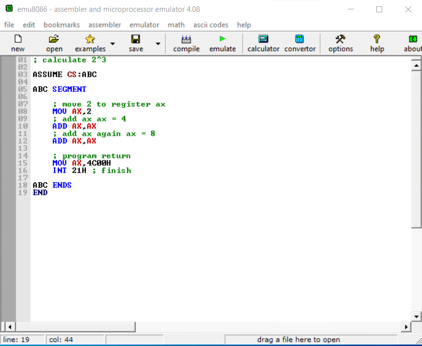
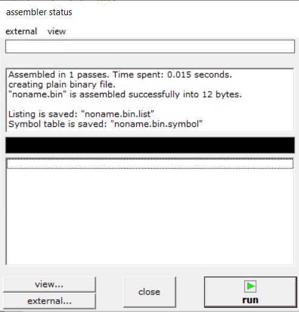
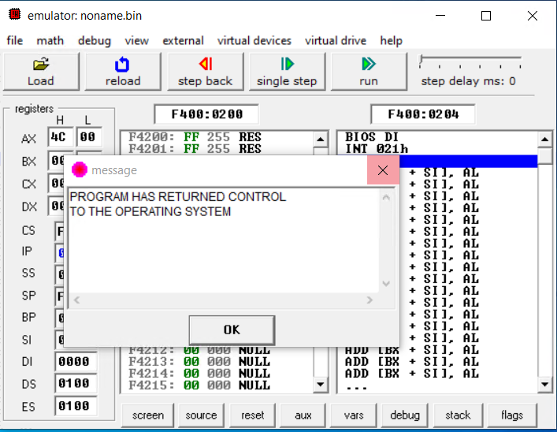
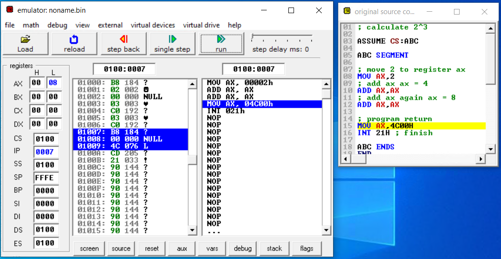

# 汇编语言学习的例子

这是汇编语言学习的示例代码，基于王爽 - 《汇编语言》一书，如果你看到了这里，希望它能对你有所帮助。

我想你也许和我一样，想要理解计算机的运行原理，那么理解汇编语言这门传说中的语言就必不可少了。

下面附上 《汇编语言》中的一段话，大家共勉：

> 这里再次强调下，我们学习汇编的主要目的，就是通过用汇编语言进行编程而深入地理解计算机底层的基本工作机理，达到可以随心所欲地控制计算机的目的。基于这种考虑，我们的编程活动，大都是直接对硬件进行的。我们希望直接对硬件编程，却并不希望用机器码编程。

## 8bit 二进制计算机

当然，如果有兴趣的话，可以参考下面我的另一个项目，

<https://github.com/StevenKangWei/computer>

它基于 LogicCircuit 从门电路开始，一步步的实现了一个 8bit 计算机。并且实现了简单的汇编语言，也同样希望对你有所帮助。

差不多可以理解为汇编语言描述了怎么使用寄存器，而它表述了寄存器是什么。

## emu8086

由于 Windows 10 中早就没有了 Debug 工具，于是我找到了 `emu8086` 来模拟 8086 处理器，效果还不错

下面附上下载连接 : <https://download.cnet.com/Emu8086-Microprocessor-Emulator/3000-2069_4-10392690.html>

- 用户名：随便输入
- 注册码：27R3VDEFYFX4N0VC3FRTQZX

## 操作方法

1. 安装程序，然后输入注册码
2. 将代码复制到文本框中，注释中文会乱码

```asm
; calculate 2^3

ASSUME CS:ABC

ABC SEGMENT

    ; move 2 to register ax
    MOV AX,2
    ; add ax ax = 4
    ADD AX,AX
    ; add ax again ax = 8
    ADD AX,AX

    ; program return
    MOV AX,4C00H
    INT 21H ; finish

ABC ENDS
END
```



3. 点击 **compile** 进行编译，编译成功后，会提示存储 `bin` 文件。



4. 点击 **run** 运行程序。



5. 运行太快的话，可以使用 **single step** 单步调试，这样就可以看到 寄存器 和 内存的详细变化了。



6. 祝年轻人万事如意！

## 参考资料

- [王爽 - 《汇编语言》](https://book.douban.com/subject/3037562/)
- [emu8086](http://www.emu8086.com/)

